# BioSkin decoder validation — findings and deliverable

## What we checked
Took the exact 3,624 curated (melanin, haemoglobin, thickness, melanin-ratio,
oxygenation) combinations from the biophysical Monte Carlo simulation dataset,
ran them through both pretrained decoders (BioSkinAO and non-AO BioSkin,
occlusion=1.0 for AO), and compared the decoded spectra directly against the
ground-truth simulated spectra for the *same* parameters.

## What we found

1. **The originally-shared "all spectra failed validation" dataset was not
   sampled from the parameter file everyone assumed.** The props CSV paired
   with those failed spectra (3,000 rows, uniform [0,1] sampling on melanin/
   haemoglobin/oxygenation/ratio simultaneously) shares zero rows with the
   curated 1,282-row file that was actually intended as input. Unconstrained
   parameter combinations — sampling each property independently with no
   biological-plausibility rejection — will produce unrealistic reflectance
   regardless of which decoder generates them.

   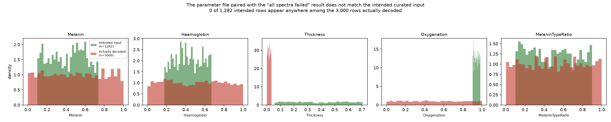

   Thickness and oxygenation are the clearest visual divergence (the
   intended file is tightly concentrated near 0.9–1.0 oxygenation; the
   actually-decoded file is uniform across the full range). Melanin,
   haemoglobin, and melanin-ratio look superficially similar in marginal
   distribution — the rigorous evidence is the exact row-match count (0 of
   1,282), not this histogram alone, since matching marginals don't imply
   matching joint combinations.

2. **BioSkinAO reproduces the simulation reasonably on chromophore indices
   (MI/EI) but has a real, systematic full-curve bias.** RMSE vs. ground
   truth: mean 0.086 (full spectrum, 380–998nm). The bias is not random —
   it's a "gain"-like darkening that correlates strongly with epidermal
   thickness (r=-0.76) and grows toward the red/near-IR end of the spectrum.

   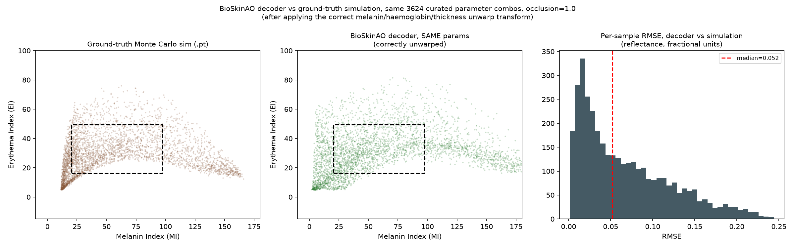
   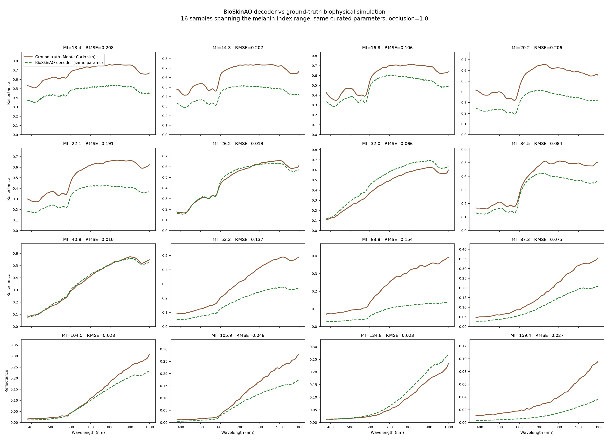
   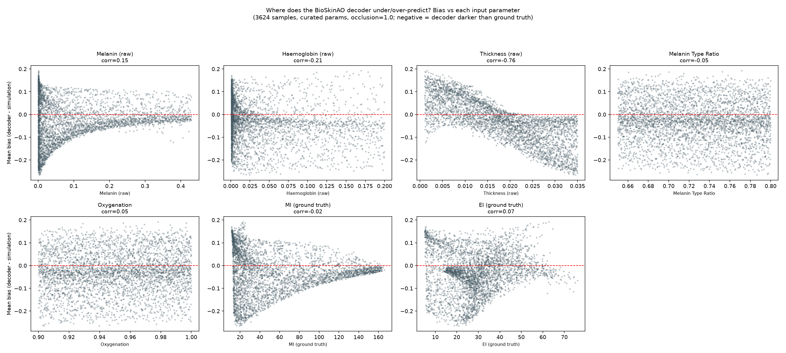

   The curve examples make the pattern visible directly: AO tracks the
   ground-truth *shape* well but is often uniformly too dark — most clearly
   at MI 53–87 where the gap is large and roughly constant across
   wavelength. The bias-vs-parameter scatter shows thickness (r=-0.76) is
   the dominant driver, far ahead of haemoglobin, oxygenation, or melanin.

3. **Root cause: AO's spectral decoder loss is Spectral Angle Mapper (SAM),
   which is magnitude-invariant by construction.** It supervises spectral
   *shape*, not absolute reflectance level. The non-AO model's spectral
   decoder loss is a direct L1 on the spectrum, which does supervise
   magnitude. Matched-parameter comparison:

   | model | RMSE (full spectrum) | mean bias |
   |---|---|---|
   | BioSkinAO | 0.086 | -0.030 |
   | BioSkin (non-AO) | 0.027 | +0.019 |

   Non-AO tracks the ground truth ~3x more tightly, and its residual bias is
   an order of magnitude smaller and not systematically tied to any single
   parameter the way AO's is.

   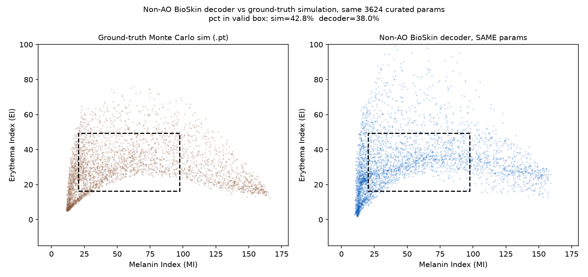
   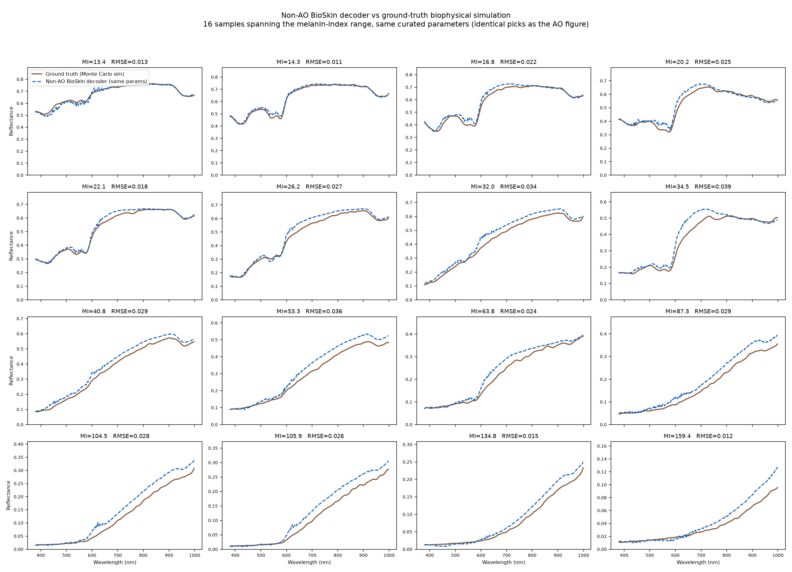
   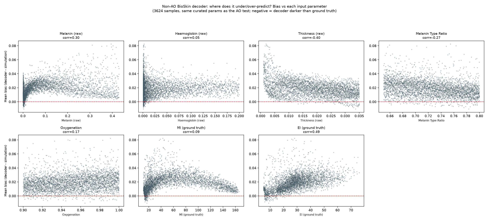

   Same 16 samples as the AO curve-examples figure above, for direct
   comparison — note the bias-vs-parameter plot's y-axis is roughly 5–8x
   narrower in range than AO's equivalent plot.

4. **The thickness sensitivity is a symptom of a broader issue, not a bug
   specific to occlusion.** We tested whether "more occlusion" and "more
   thickness" push the decoded spectrum in a confusable direction (cosine
   similarity of their effect on the spectrum): 0.97, essentially parallel.
   But a control test — "more thickness" vs. "more melanin" — is *also*
   0.95. Skin reflectance spectra live close to a low-dimensional manifold
   dominated by one broad "darkness" mode, so any parameter that increases
   absorption pushes the output in a similar direction. Under a
   magnitude-blind loss (SAM), the network has little signal to correctly
   apportion darkening between melanin, thickness, and occlusion — they're
   nearly interchangeable to that objective. This is a property of the loss
   function, not a specific occlusion/thickness confound.

   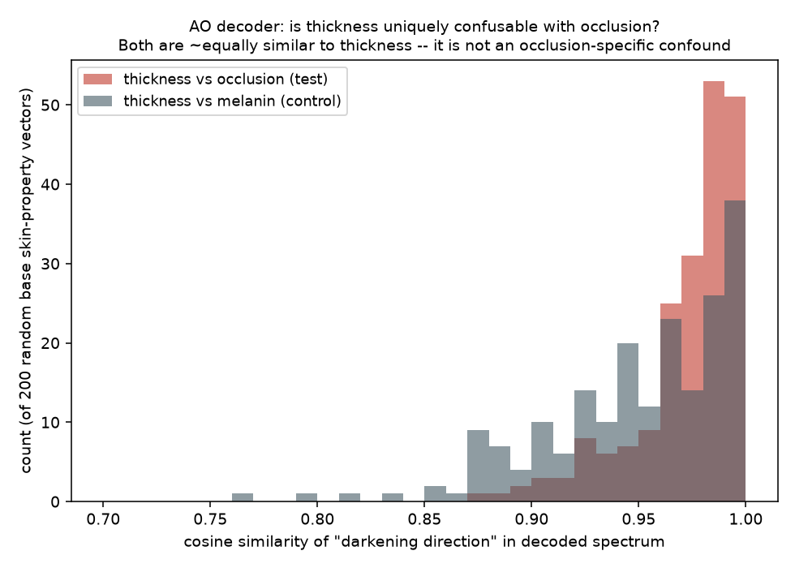

5. **Restricting epidermal thickness to a physiologically realistic range
   nearly eliminates AO's bias too**, independent of which model is used.
   The codebase already defines a "regular skin" thickness bound (0.005–0.025,
   i.e. 50–250 microns — bioskin/parameters/parameter.py,
   REGULAR_SKIN_MIN/MAX_VALUES) versus the full curated range used in the
   simulation dataset (0.001–0.035, i.e. up to 350 microns — added mainly to
   give the *encoder* headroom when reconstructing from captured albedo
   textures, not because 350um is typical facial epidermis).

   | model | full thickness range | regular range (50-250um) |
   |---|---|---|
   | AO RMSE / bias | 0.086 / -0.030 | 0.066 / -0.007 |
   | non-AO RMSE / bias | 0.027 / +0.019 | 0.028 / +0.020 (unaffected) |

   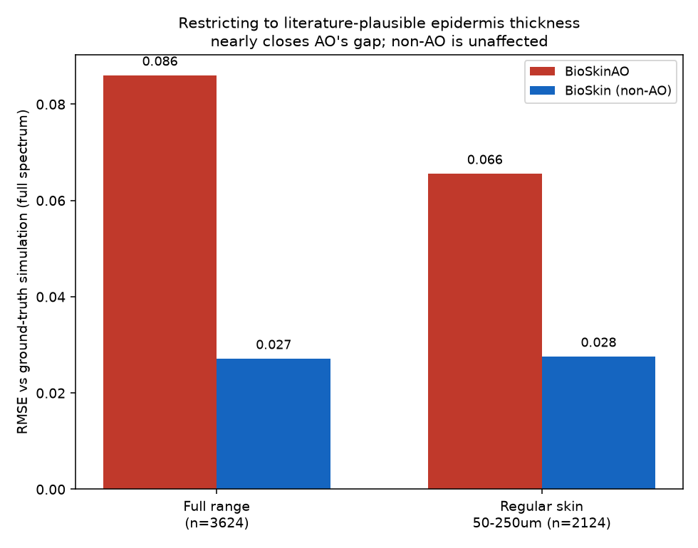

   Same 16-sample, MI-stratified view as points 2/3, but now drawn only from
   the restricted 50–250um subset, for both decoders:

   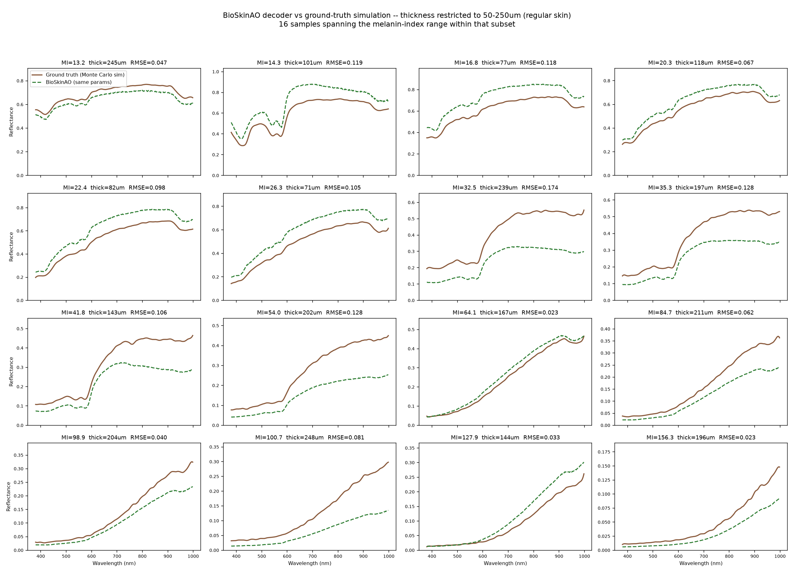
   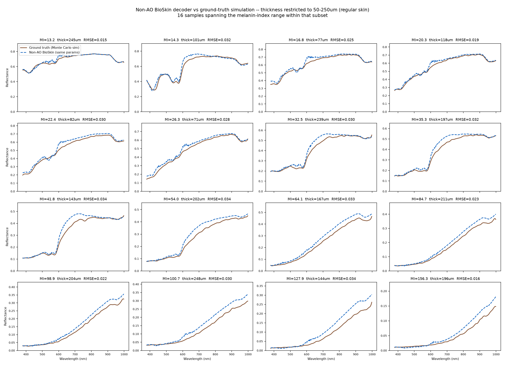

   Non-AO is consistently tight here (RMSE 0.015–0.034 across all 16). AO's
   *aggregate* error drops with the restriction, but individual curves are
   still uneven — several samples in this same restricted range still show
   RMSE 0.10–0.17 (e.g. MI=32.5, MI=54.0), meaning thickness explains most
   but not all of AO's bias; some of it still comes from elsewhere
   (haemoglobin/oxygenation combinations, most likely, per point 4).

## Recommendation
Use the non-AO BioSkin decoder for generating the spectra that feed the
validation framework, and constrain epidermal thickness sampling to the
50–250 micron range. Both changes are independently justified (loss-function
fidelity and literature-plausible anatomy, respectively) and both happen to
reduce the same failure mode.

## Deliverable
`new_sample_skin_props_raw_physical_units.csv` / `new_sample_skin_props_network_ready.csv`
— 4,000 freshly-sampled parameter combinations (independent of the Meta
dataset — same curated bounds, thickness restricted to 50-250um), decoded
with the non-AO model, double-pass Savitzky-Golay smoothed
(`new_sample_spectral_reflectance_smoothed.csv`).

Chromophore-index check (bounding-box proxy against the paper's reported
retained MI/EI range, not the full two-stage BVCM test): 26.8% within range
— close to the paper's own reported 27.2% for the original simulation
dataset. This is expected: haemoglobin/oxygenation were still sampled
independently here, so the same "unconstrained parameter combination"
rejections apply. The intent of this set is to give Junhui a
correctly-generated decoder dataset to run his actual two-stage validation
on, not a pre-filtered "already valid" set.

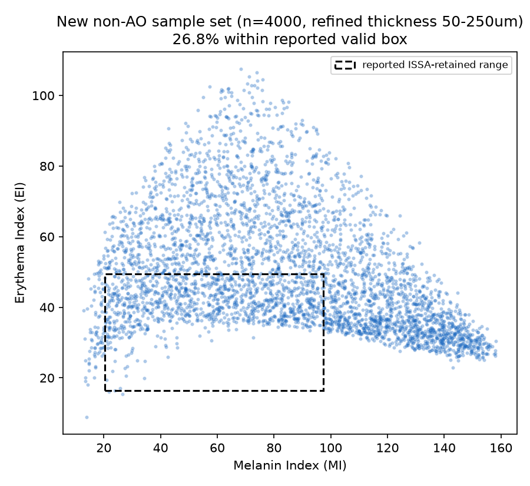
